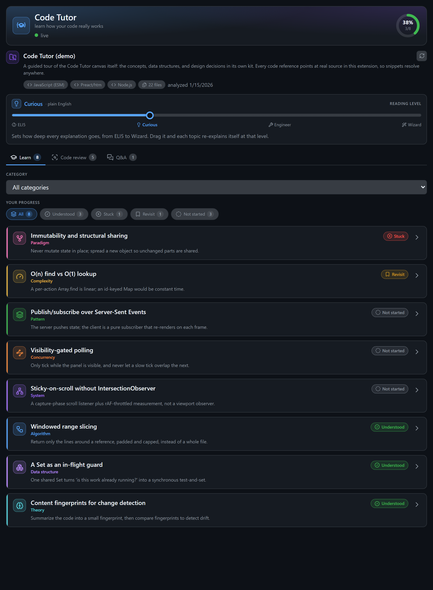
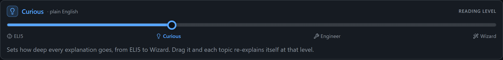
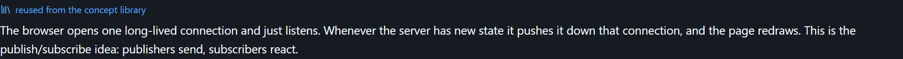
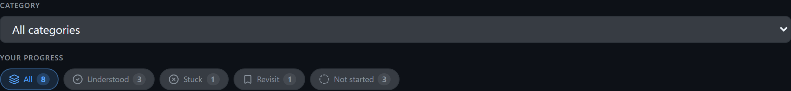
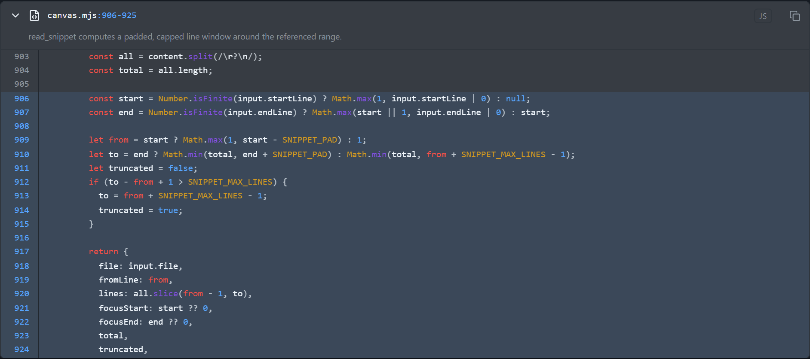
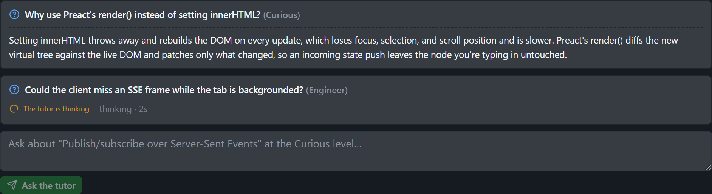
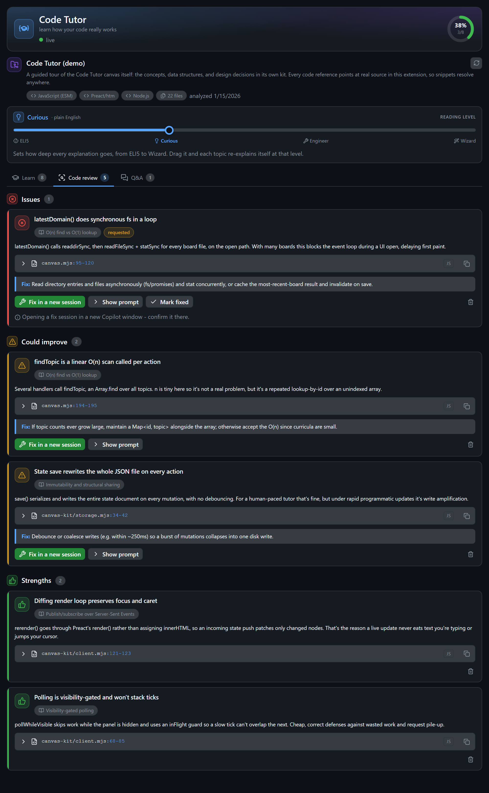
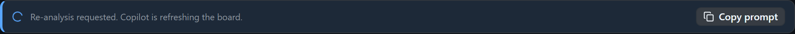

# Code Tutor

Turns the current codebase into a personal CS course. The agent reads your repo and pulls out the algorithms, data structures, complexity results, patterns and theory hiding in the code, then teaches each one at a level you choose. You learn how your own code really works.

A GitHub Copilot App **canvas extension**: the agent and the user share the same live state through the same action handlers, and the view renders with Preact + htm and a vendored kit, with no build step and no `package.json`.



## What it does

- **Extracts CS concepts from the code** and files each under a category (algorithm, data structure, complexity, theory, pattern, paradigm, concurrency, system).
- **Adjustable reading level** with a 4-stop slider: `ELI5` (like I'm 5), `Curious` (plain English), `Engineer` (technical), `Wizard` (deep). The default level is global; every topic also remembers its own.
- **Concept library cache**: generic, codebase-independent explanations are saved once and reused across boards, so the same "ELI5 of binary search" is not regenerated every time.
- **Points at real code**: every topic and finding links to a file and line range. Click a reference to expand the actual source with language-aware syntax highlighting (read straight from disk under the codebase root).
- **Mark your understanding** per topic: Understood, Not understood, Revisit, or New. A progress ring tracks how much you have understood.
- **Ask and clarify**: ask questions per topic or globally; the agent answers in the panel.
- **Code review**: flags good / ok / bad spots (perf, wrong data structures, suboptimal algorithms). When the board knows its GitHub `owner/repo`, each issue gets a one-click **Fix in a new session** deep link (`ghapp://session/new`) that opens a dedicated Copilot session to run the fix; otherwise it copies a ready-to-run prompt for the agent to pick up.
- **Freshness tracking**: fingerprints the code (git HEAD + newest file mtime) at analysis time, re-checks on a visibility-gated timer, and shows a "code changed, refresh" banner plus an always-available Refresh button. Code Tutor never re-analyzes on its own; analysis is the agent's job, so the Refresh button injects a re-analysis prompt into the current Copilot session.

## A guided tour

Every shot below comes from the built-in demo board (see [Demo mode](#demo-mode)), so you can reproduce them yourself.

### Adjustable reading level



One global slider from ELI5 to Wizard. Drag it and every topic re-explains itself at that depth.

### Concept library cache



Generic, codebase-independent explanations are cached once and reused across boards. A reused one is tagged, so you know it did not cost another model call.

### Filed by category, filtered by progress



Each concept is filed under a category (algorithm, data structure, complexity, theory, pattern, paradigm, concurrency, system). Filter by category or by how far along you are.

### Points at real code



Every topic and finding links to a file and line range. Expand a reference to read the real source, highlighted, straight from disk.

### Mark your understanding


Track each topic as Understood, Not understood, Revisit, or New. The header ring shows how much you have understood.

### Ask and clarify



Ask questions per topic or globally, at a chosen level. Answers land in the panel without polluting the chat.

### Code review



Good / ok / bad spots with the reasoning. When the board knows its `owner/repo`, each issue gets a one-click **Fix in a new session** deep link.

### Freshness tracking



The board fingerprints the code and flags when it drifts. The Refresh button hands a re-analysis prompt to the agent.

## Demo mode

Want to see Code Tutor fully populated without analyzing a repo first? Seed a demo board:

```
node demo/seed.mjs                 # writes a "demo" board to your COPILOT_HOME
node demo/seed.mjs --domain demo   # pick the board name (default: demo)
node demo/seed.mjs --home <dir>    # pick the COPILOT_HOME root
```

Then open the canvas pointed at it (`canvasId: "code-tutor"`, `input: { "domain": "demo" }`).

The board is generated on demand and written to `$COPILOT_HOME/extensions/code-tutor/artifacts/demo.json`; no data is bundled in the extension. It teaches concepts from Code Tutor's own kit, so every code reference resolves to real source wherever the extension is installed.

### Regenerating the screenshots

The images above come from that demo board, captured headless:

```
node demo/screenshot.mjs           # needs Playwright's chromium
```

It seeds a throwaway board in a temp directory, drives each feature, and writes PNGs to `docs/img/`, plus the site card at `site/public/screenshots/code-tutor.png` and the site gallery at `site/public/screenshots/code-tutor/`.

## Layout

```
extension.mjs        the ONLY file that imports the Copilot SDK (thin adapter)
canvas.mjs           canvas config: state load/save + action handlers (SDK-free)
cache.mjs            the cross-board concept library + the codebase-specific heuristic
canvas-kit/          vendored kit (copied verbatim; do not edit)
web/index.html       shell that loads /kit/theme.css, ./styles.css and ./app.mjs
web/app.mjs          the Preact view
web/highlight.mjs    dependency-free, language-aware syntax tokenizer
web/styles.css       the visual design system
demo/seed.mjs        buildDemoState() + CLI to seed a fake "demo" board (generated, never bundled)
demo/screenshot.mjs  boots the demo board headless and captures the screenshots above
docs/img/            the per-feature screenshots (regenerated by demo/screenshot.mjs)
test/smoke.test.mjs  boots the runtime over HTTP and exercises the actions
```

## Validate

```
node test/smoke.test.mjs
```

## Install

Copy this folder into `.github/extensions/code-tutor` (in-repo) or
`$COPILOT_HOME/extensions/code-tutor` (personal), then run `extensions_reload` and
open it with `open_canvas` (`canvasId: "code-tutor"`). Point it at a codebase by
asking Copilot to analyze the repo; it calls `set_codebase` (with a `root` so
code references resolve, and optionally `repo` as `owner/repo` to enable the
"Fix in a new session" deep links) and then authors the topics, references and
findings.

## Keeping the kit current

`canvas-kit/` is a vendored snapshot of the create-canvas-app `kit/`. Re-sync it
with the skill's `scripts/sync-kit.mjs`, and gate drift in CI with
`scripts/check-kit-freshness.mjs`.
