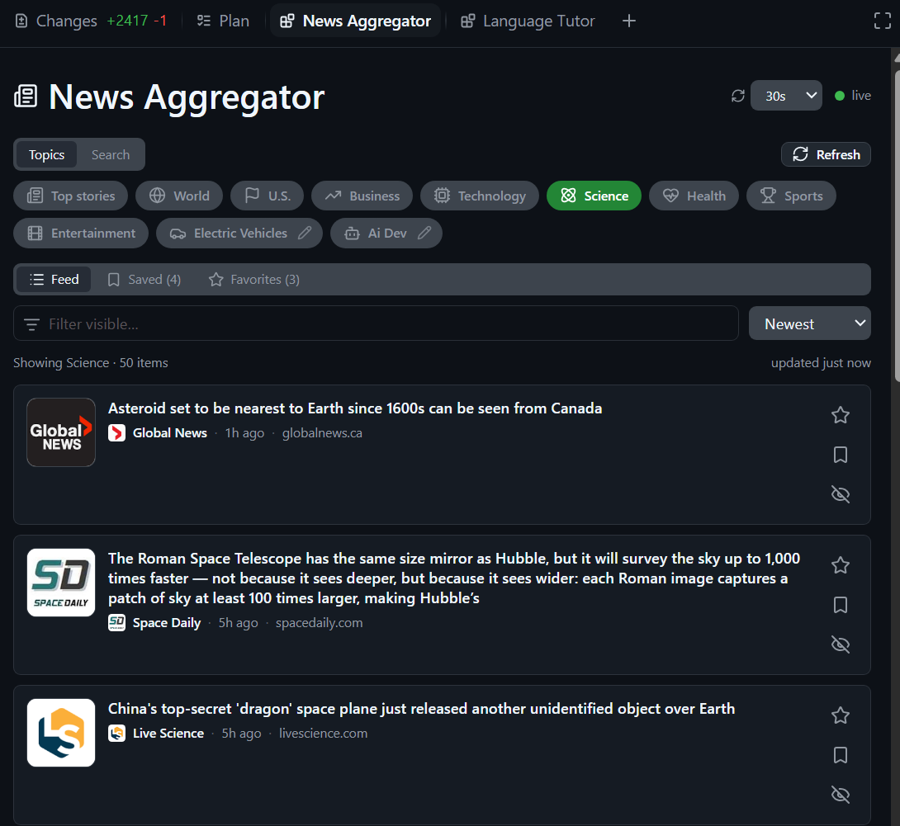

# News Aggregator

A shared, live news-feed canvas for the GitHub Copilot app. Pick a topic or run a
free-text search and headlines stream in as cards — the agent and you share the
**same** feed, marks, pinned topics, and history, kept in sync live.



## Features

- **Topics + free-text search** — nine built-in topics (Top stories, World, U.S.,
  Business, Technology, Science, Health, Sports, Entertainment) plus a search box,
  backed by Google News RSS (no API key).
- **Source-brand tiles** — every card shows the publisher's favicon as a brand
  thumbnail, with a tinted letter fallback. *(Google News links resolve to a
  Google interstitial whose `og:image` is always the same generic Google logo, so
  real per-article photos aren't available — the source's own brand mark is used
  instead.)*
- **Save · Favorite · Hide** — per-article marks that are durable and survive feed
  refetches.
- **Feed / Saved / Favorites** views with live counts.
- **Search history** — re-run a recent query, remove one, or clear all.
- **Pin a search as a custom topic** — it becomes a chip with an auto-picked icon
  (e.g. *electric vehicles* → 🚗); edit its label, query, and icon, or remove it.
- **Sort & filter** — order by newest, oldest, source, or title, and filter the
  visible items.
- **Auto-refresh** — refresh on a selectable interval (Off–10m), only while the
  canvas is visible.

## Install

From inside Copilot (app or CLI), just ask the agent:

> **install the news-aggregator canvas from jongio/copilot-extensions/extensions/news-aggregator**

Then, in the app:

> **open news aggregator**

## Use it

Drive it from the panel, or ask the agent — both run the same actions:

> **set topic technology** · **search "mars rover"** · **pin that search** ·
> **set auto refresh to 60s** · **show my saved articles**

## How it works

Built on [`create-canvas-kit`](https://github.com/jongio/skills/tree/main/skills/create-canvas-kit)
(Preact + htm, Lucide icons, SSE live state, durable per-domain storage). All
network I/O happens server-side in `canvas.mjs` using Node's built-in `fetch`
(no dependencies); `web/app.mjs` is a pure renderer. State is keyed by a *domain*
resolved from the open input (default `default`), so separate feeds — e.g.
`work`, `sports` — stay isolated and can be opened in multiple panels in sync.

```
extension.mjs   # thin SDK adapter (only file that imports the Copilot SDK)
canvas.mjs      # feed fetch + RSS parse + all action handlers (SDK-free)
canvas-kit/     # the kit (vendored verbatim)
web/            # index.html shell + app.mjs Preact view
```
